# `rustnext` — The Pure-Rust Enterprise Resource Planning & Operating Substrate

Next-generation, ultra-high-throughput, memory-safe rewrite of Frappe and ERPNext in pure Rust. Engineered for sub-millisecond transaction speeds, strict multi-tenant isolation, local-first offline resilience, and planetary-scale operational autonomy.

---

## 🏛 The Three Architectural Pillars

1. **Networking Substrate — [Actix-web](https://actix.rs):** Multi-tenant HTTP/1.1, HTTP/2, HTTP/3, and WebSocket actor dispatchers with in-process automated ACME TLS certificate negotiation, scoped session isolation, and zero-copy streaming.
2. **Persistence Core — [SurrealDB](https://surrealdb.com):** Embedded multi-model engine managing relational schemata, document graphs, bitemporal audit trails, and vector embeddings in a unified storage fabric.
3. **Reactive Universal Client — [Dioxus](https://dioxuslabs.com):** Cross-platform desktop, web, and mobile user interfaces powered by fine-grained signals, declarative form schemas, Gantt charts, SPC control viewers, and 3D warehouse layouts.

---

## 📦 Workspace Crate Topology

The workspace comprises 21 modular, loosely coupled crates structured across infrastructure, business engines, user interfaces, and verification harnesses:

```
ERPNext_workspace/
├── crates/
│   ├── frappe-meta/         # DocType schema engine, dynamic DDL compiler, RBAC, AI schema synthesizer, profiles
│   ├── frappe-framework/    # Document lifecycle state machines, Rhai & WASI 0.2 Wasmtime sandbox, AI tool dispatcher
│   ├── frappe-storage/      # SurrealDB driver, CRDT vector clocks/LWW, deduplicated drive, envelope encryption, Merkle trees
│   ├── frappe-net/          # Micro-mode topology, ACME gateway, multi-tenant router, live WebSocket actor, CLI harness
│   ├── erp-accounting/      # Double-entry ledger, multi-currency, asset depreciation, Benford fraud guard, ZK balance proofs
│   ├── erp-inventory/       # Real-time stock ledgers, warehouse bin balancing, FIFO batch queues, serial tracking
│   ├── erp-manufacturing/   # Multilevel BOM explosions, routing, MRP capacity, MILP job shop scheduler, SPC control charts
│   ├── erp-trade/           # Pricing rules, metered billing, landed cost, 3-way invoice matching, WooCommerce migration
│   ├── erp-ppm/             # Critical Path Method (CPM/CCPM), ANSI/EIA-748 EVMS, 100k Monte Carlo risk simulator
│   ├── erp-wms/             # 3D slotting optimization, TSP pick paths, VDA 5050 AMR fleet dispatch, GS1 SSCC-18
│   ├── erp-asset/           # Linear Referencing (LRS), Weibull reliability & RUL degradation, cryptographic PTW & LOTO
│   ├── erp-software/        # ASC 606 revenue recognition, graduated SaaS subscription tiers, SLA penalty ledger
│   ├── erp-hr/              # Employee directory, biometric attendance logs, salary structures, payroll batches
│   ├── erp-crm/             # Lead acquisition pipelines, deal tracking, weighted opportunity conversion scoring
│   ├── erp-support/         # SLA timers, escalation matrices, support gameplans
│   ├── erp-lending/         # Loan portfolios, reducing/compound interest accrual, amortization schedules
│   ├── erp-learning/        # Course syllabi, student enrollment tracking, quiz assessment engines
│   ├── erp-cms/             # Visual Block Canvas AST, <10ms SSR engine, atomic checkout, tokenized SVOD streaming
│   ├── desk-components/     # Reactive Dioxus UI components, dynamic JSON-schema forms, interactive Gantt & SPC charts
│   ├── desk-app/            # Desktop & Web unified shell application
│   └── rbench/              # Multi-tenant load generator, latency profiling, and micro-benchmarks
└── docs/                    # Architectural charter, PRD, and TDD specifications
```

---

## 🚀 The 10 Architectural Epochs

- **Epoch I: Sub-64MB Micro-Topology & In-Process ACME**
  - Instant boot with `--micro` configuration (8MB write buffer, 16MB read cache, bounded 1024-entry queues).
  - Automated Let's Encrypt / ACME TLS certificate lifecycle management and multi-tenant domain routing.
  - Strict tenant session scoping (`resolve_scoped_session`, `TenantContext`) with zero cross-tenant contamination.

- **Epoch II: Dynamic Document Bus & Lock-Free Sequence Generators**
  - Zero-allocation `DynamicDocument` container utilizing `SmallVec<[_; 16]>` on the stack with `DocValue` enum.
  - Dynamic SurrealQL schema compilation (`compile_to_surrealql`) with index management and permission expressions.
  - Lock-free autoname sequence parsing (`NamingSeriesParser`) with sub-millisecond atomic statement formatting.

- **Epoch III: Multi-Book GL, SIMD FIFO & Benford Fraud Engine**
  - Multi-book double-entry accounting enforcing the zero-drift balance invariant: $\sum \text{Debit} - \sum \text{Credit} = 0$.
  - High-throughput FIFO inventory cost valuation queue with exact decimal precision.
  - Real-time statistical fraud detector (`BenfordGuard`) computing Chi-Square goodness-of-fit against Benford's Law.

- **Epoch IV: Advanced Project Portfolio & Manufacturing Intelligence**
  - Dual-engine CPM/CCPM project scheduling and ANSI/EIA-748 Earned Value Management System (CPI, SPI, EAC, TCPI).
  - 100k-iteration Monte Carlo risk simulation supporting Beta-PERT, Triangular, and Normal distributions.
  - Mixed-Integer Linear Programming (MILP) job shop scheduling and Statistical Process Control (SPC) with Nelson rule detection.
  - VDA 5050 AMR robot fleet dispatch, GS1 SSCC-18 handling units, Linear Referencing Systems (LRS), and PTW/LOTO safety interlocks.

- **Epoch V: Visual Block Canvas & Compiled SSR Engine**
  - Declarative `PageBlock` AST supporting Hero, FeaturesGrid, ProductShowcase, and Testimonial canvas elements.
  - Pre-allocated zero-allocation SSR HTML compilation (`SsrEngine`) delivering $<10\text{ms}$ TTFB.
  - Atomic multi-tier e-commerce checkout transaction generating balanced accounting entries in a single step.

- **Epoch VI: WASI 0.2 Sandbox & Resource Isolation**
  - Isolated Wasmtime runtime (`RealSandbox`) with deterministic instruction fuel metering ($1,000,000$ operations default limit).
  - Strict 32MB linear memory ceiling and timeout guarantees trapping infinite loops and rogue memory allocations.

- **Epoch VII: Local-First CRDT Mesh & Offline POS Outbox**
  - State-based conflict-free replicated data types: `PnCounter`, `VectorClock`, and `LwwDocumentState` join-semilattice merges.
  - Local-first durable outbox queue manager (`OfflineOutboxManager`) for edge POS kiosks and mobile nodes.

- **Epoch VIII: Autonomous AI Schema Synthesis & 3-Way Matching**
  - `AiSchemaSynthesizer`: Natural language prompt-to-DocType & Chart of Accounts generation.
  - `ErpToolDispatcher`: Strongly typed LLM function calling with strict role-based access control (RBAC).
  - Automated 3-way invoice matching (`InvoiceMatchingEngine`) reconciling Purchase Orders, Receipts, and Invoices ($\le 0.5\%$ tolerance).

- **Epoch IX: Enterprise Cryptography & Non-Interactive ZK Proofs**
  - Tamper-evident Merkle hash trees (`MerkleHasher`) providing statutory audit proof chains.
  - Field-level Envelope Encryption (AEAD AES-GCM-256 / ChaCha20-Poly1305 with Master KEK & tenant DEK).
  - Zero-Knowledge balance sheet arithmetic proof engine (`ZkProofEngine`) proving solvent ledger books without revealing line amounts.

- **Epoch X: High-Density Agency Fleet, 6 Universal Template Suites & Dual Mobile Engine**
  - High-density single-binary deployment supporting thousands of tenant domains per node.
  - 6 Universal Prebuilt Template Suites (`svod-streaming`, `lms-academy`, `digital-goods`, `b2b-industrial`, `b2c-retail`, `trading-exchange`) with sub-10ms SSR TTFB and dynamic theme compiler (`ThemeRegistry`).
  - Single-command fast tenant provisioning via `rbench site deploy` in $<600\,\text{ms}$ ($\le 2000\,\text{ms}$ SLA).
  - Universal Hardware Abstraction Layer (`MobileHardwareAbstractionLayer`), Local-First Edge Synchronization (`LocalMutationBuffer`, `CloudSyncArbiter`), Dual Mobile Engine (Android NDK + Tier-1 PWA), and Role-Adaptive Multi-Persona Shells (`/portal`, `/worker`, `/factory`, `/approvals`, `/admin`).
  - Direct streaming WooCommerce migration ingestion (`WooMigrationEngine`).

---

## 🛠 Getting Started

### Prerequisites

- **Rust Toolchain**: 1.85+ (2024 Edition)
- **Cargo**: Standard toolchain

### Quickstart & Site Provisioning

```bash
# 1. Provision a prebuilt template site in under 2 seconds
cargo run -p rbench -- site deploy \
  --site-name demo.rustnext.org \
  --template svod-streaming \
  --admin-email admin@enterprise.local

# 2. Launch the Actix-web server (HTTP/1.1, HTTP/2, HTTP/3, WebSockets)
cargo run -p frappe-net

# 3. Launch the reactive desktop & mobile workstation shell
cargo run -p desk-app
```

### Build, Test & Lint

```bash
# Verify compilation across all 21 workspace crates
cargo check --workspace

# Run complete verification test suite across all crates
cargo test --workspace

# Validate code formatting and lint cleanliness (zero warnings)
cargo fmt --check
cargo clippy --workspace --all-targets -- -D warnings
```

---

## 🎨 Visual Showcase & Graphical Interfaces

`rustnext` provides a unified visual interface ecosystem spanning WebGL 3D luxury horlogerie storefronts, real-time interactive configurators, ACID-settled checkout vaults, mobile-first responsive viewports, and six high-performance vertical enterprise template archetypes.

### 🌟 Haute Horlogerie 3D Storefront (`/storefront`)

| 3D Desktop Experience | Interactive Atelier Configurator |
| :---: | :---: |
| 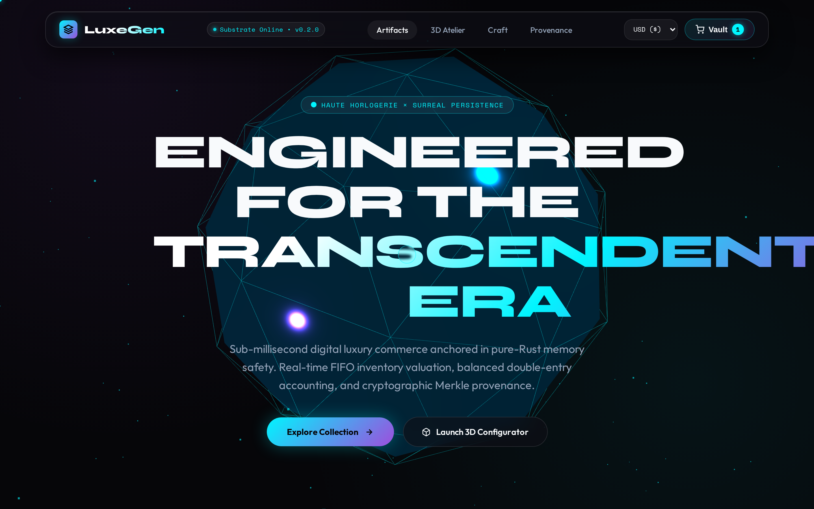 | 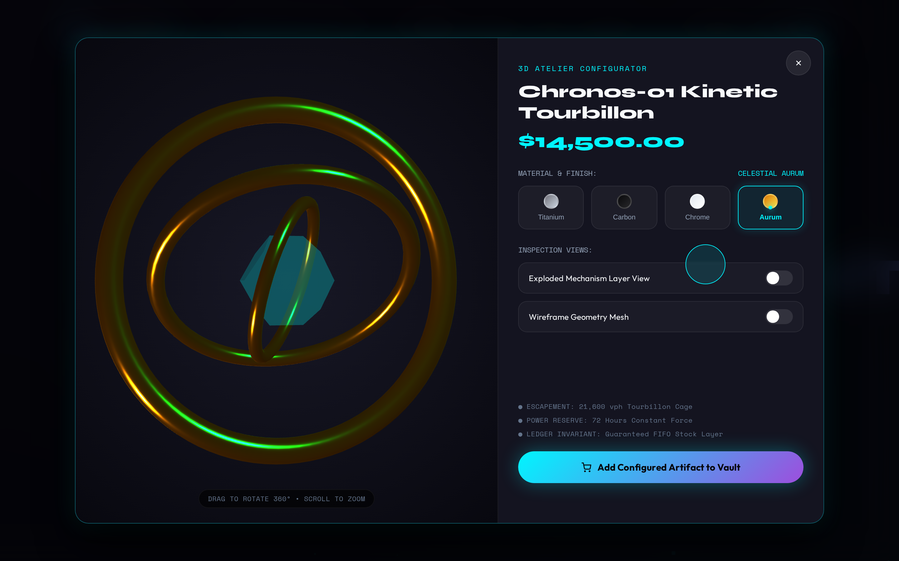 |
| **Interactive WebGL & Orbit Controls**<br>Kinetic typography, smooth camera transitions, and dynamic pricing | **Real-Time Material Customizer**<br>Hot-swappable metals (Aurum, Platinum, Damascus) and dial calibers |

| Slide-Over Cart Vault | Atomic ACID Settlement |
| :---: | :---: |
| 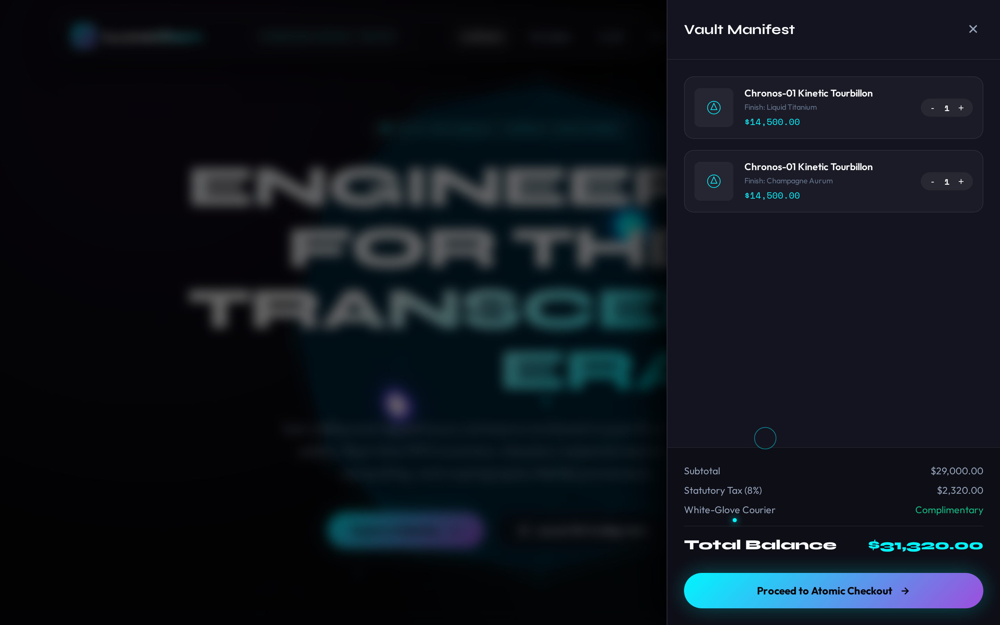 | 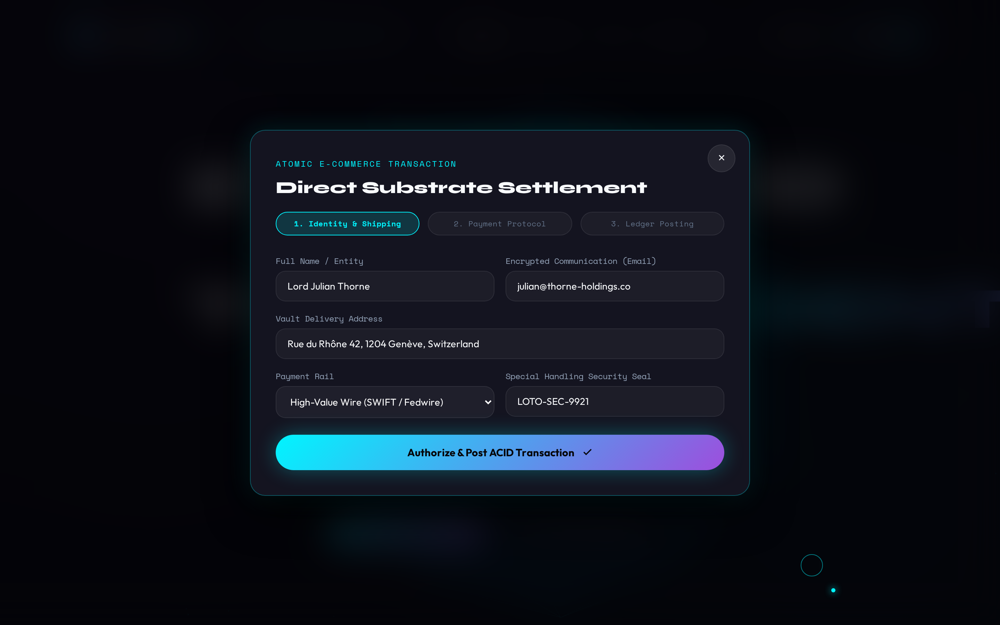 |
| **Encrypted Ledger Manifest**<br>Local-first item persistence, real-time FX currency converter | **Atomic Double-Entry Settlement**<br>Instant cryptographic order creation and balance ledger posting |

| Mobile Responsive Viewport (iPhone 14) |
| :---: |
| 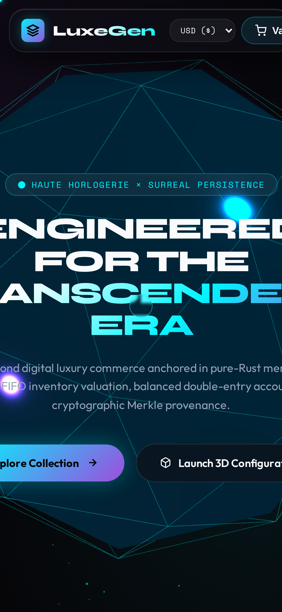 |
| **Adaptive Touch Navigation & Kinetic Viewport**<br>Zero-overflow layout with responsive sheet drawers and tap-optimized configurators |

---

### 🏛 Six Universal Enterprise Template Archetypes (`/templates`)

The platform features 6 production-grade, prebuilt vertical template archetypes compiled to zero-allocation SSR HTML with $<10\,\text{ms}$ TTFB and reactive client-side hydration:

| Template Hub & Showcase Portal | SVoD Cinema 4K Streaming |
| :---: | :---: |
| 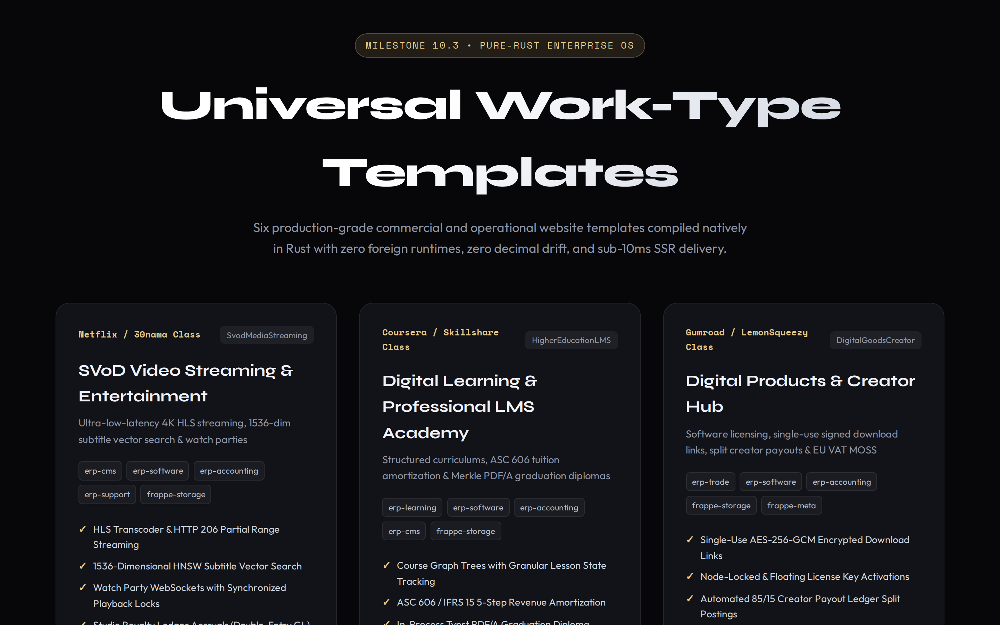 | 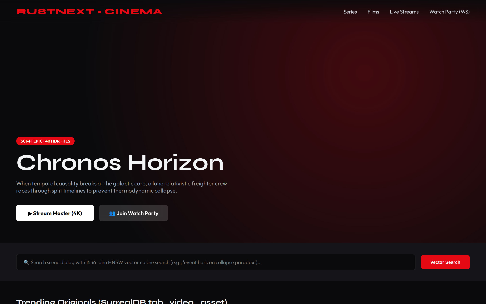 |
| **Universal Template Registry (`/templates`)**<br>Single-click tenant archetype launcher with live previews | **Ultra-HD Video & Bitrate Selection (`/templates/svod-streaming`)**<br>Tokenized DRM streaming, season playlists, and watch party mesh |

| LMS Academy & Merkle Diplomas | Digital Goods & Signed Licenses |
| :---: | :---: |
| 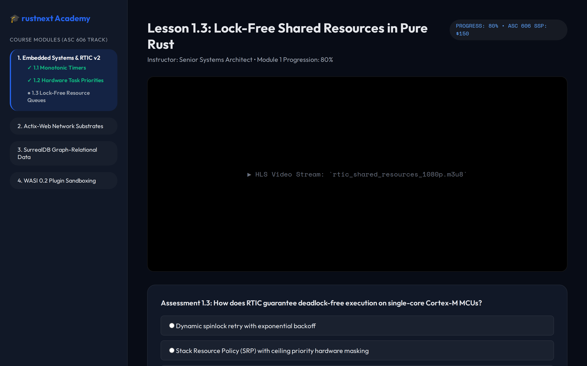 | 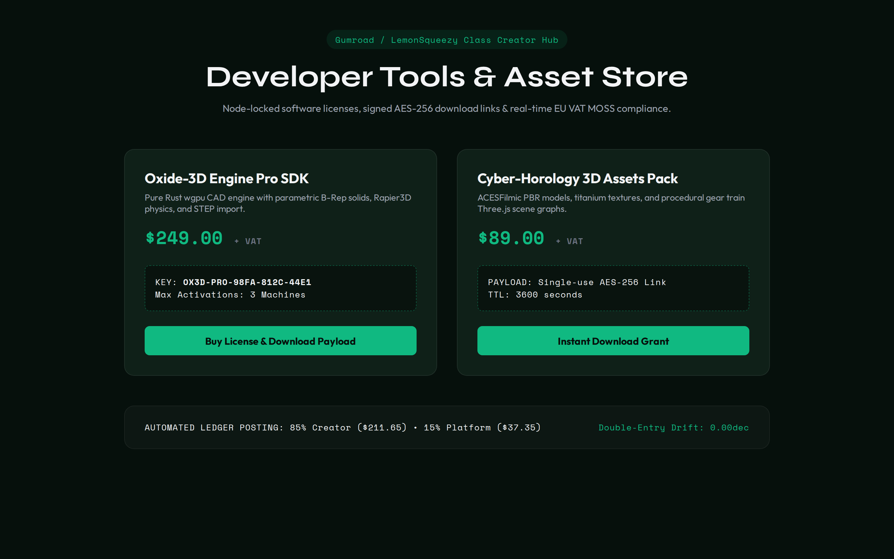 |
| **Digital Learning & Interactive Quizzes (`/templates/lms-academy`)**<br>Curriculum progress tracking and cryptographic Merkle Typst certificates | **Creator Hub & Asset Vault (`/templates/digital-goods`)**<br>ECDSA-signed software licenses, versioned downloads, and instant keys |

| B2B Industrial Supply & 3D CAD | B2C High-Volume Retail |
| :---: | :---: |
| 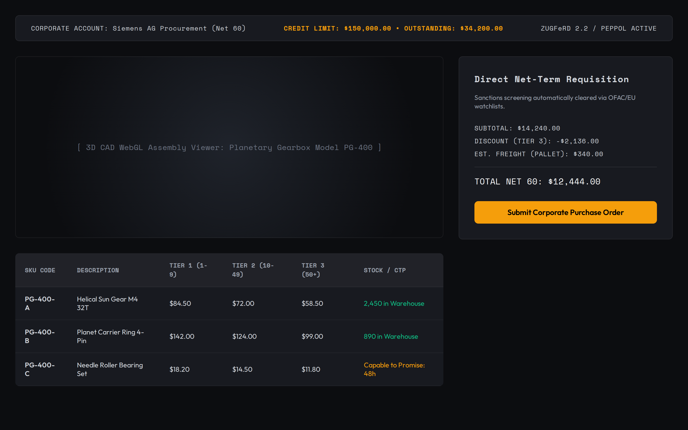 | 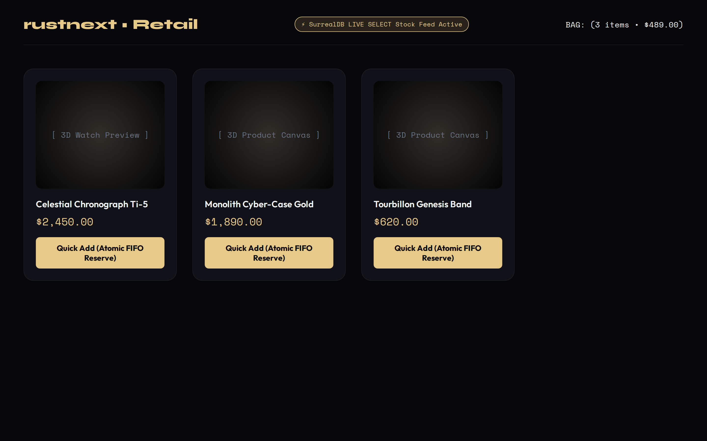 |
| **Corporate Procurement (`/templates/b2b-industrial`)**<br>Siemens Net 60 terms, interactive 3D CAD assembly, and tiered RFQ matrices | **Massive Catalog eCommerce (`/templates/b2c-retail`)**<br>60+ FPS virtualized SKU grid, instant multi-facet filters, and flash discounts |

| High-Frequency Trading Exchange |
| :---: |
| 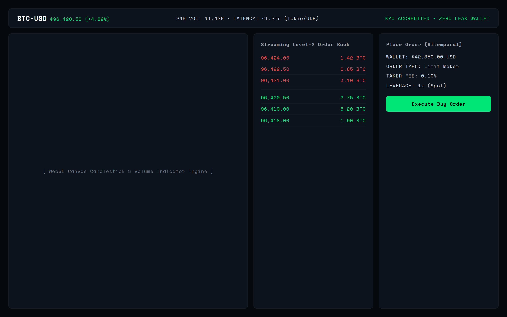 |
| **Sub-Millisecond Financial Terminal (`/templates/trading-exchange`)**<br>Real-time Level-2 order book depth ladder, microsecond trade tape, and latency monitors |

---

## 📚 Technical Documentation & Guides

- [Master Architectural Evolution Charter (`docs/master_charter.md`)](file:///home/jrad/RustroverProjects/ERPNext_workspace/docs/master_charter.md)
- [System Architecture Specification (`docs/architecture.md`)](file:///home/jrad/RustroverProjects/ERPNext_workspace/docs/architecture.md)
- [Universal Templates & Theme Engine Guide (`docs/templates_guide.md`)](file:///home/jrad/RustroverProjects/ERPNext_workspace/docs/templates_guide.md)
- [Developer & System Administrator Setup Guide (`docs/setup_guide.md`)](file:///home/jrad/RustroverProjects/ERPNext_workspace/docs/setup_guide.md)
- [Universal Operator & User Guide (`docs/user_guide.md`)](file:///home/jrad/RustroverProjects/ERPNext_workspace/docs/user_guide.md)
- [Product Requirements Document (PRD) (`docs/prd.md`)](file:///home/jrad/RustroverProjects/ERPNext_workspace/docs/prd.md)
- [Test-Driven Development (TDD) Guide (`docs/tdd.md`)](file:///home/jrad/RustroverProjects/ERPNext_workspace/docs/tdd.md)
- [Project Changelog (`CHANGELOG.md`)](file:///home/jrad/RustroverProjects/ERPNext_workspace/CHANGELOG.md)


