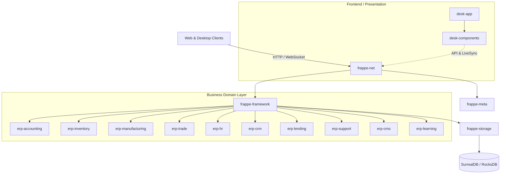

# System Architecture Specification

## 1. High-Level Architecture Overview

ERPNext Rust is designed with a layered, modular micro-crate architecture prioritizing strict boundary separation, multi-tenant isolation, memory safety, and high-throughput concurrency.

---

## 2. Core Infrastructure Crates

### `frappe-meta`
- **Schema Engine**: Parses and compiles declarative DocType definitions (fields, data types, validators, relationships).
- **Role-Based Access Control (RBAC)**: Fine-grained permissions per document and field level (Read, Write, Create, Submit, Cancel, Delete).
- **Naming Series**: Thread-safe autoname generator supporting expression templates (e.g. `ACC-.YYYY.-.#####`).
- **Migration Runner**: Declarative schema migrations ensuring backwards-compatible state evolutions.

### `frappe-framework`
- **Document Model**: Strongly typed `Document` abstractions with dirty field tracking and validation pipelines.
- **Lifecycle Engine**: Strict transition stages: `validate` → `before_save` → `on_update` → `before_submit` → `on_submit` → `on_cancel`.
- **Scripting & Extensibility**: Dual-engine embedded sandbox supporting dynamic runtime scripting via Rhai and WASI plugins via Wasmtime.

### `frappe-storage`
- **Multi-Model Engine**: High-performance SurrealDB abstraction managing structured records, document graphs, and time-series ledgers.
- **Content-Addressable Drive**: Deduplicated file storage engine utilizing SHA-256 chunk hashing, MIME validation, and virtual directory hierarchies.

### `frappe-net`
- **Multi-Tenant Server**: Actix-web powered RESTful and JSON-RPC dispatchers with automatic tenant resolution from headers/hostnames.
- **Real-Time LiveSync**: Async broadcast channels distributing real-time document change events and notifications over WebSockets.
- **Background Queue**: Async job queue worker pool handling asynchronous workloads, bulk imports, and scheduled tasks.

---

## 3. Enterprise Business Domains

| Domain Crate | Responsibilities | Key Traits & Engines |
| :--- | :--- | :--- |
| **`erp-accounting`** | Double-entry bookkeeping, multi-currency ledger, Chart of Accounts, Asset depreciation, AR/AP tracking. | Immutable GL entries, zero-imbalance validation, precision arithmetic. |
| **`erp-inventory`** | Warehouse bin balancing, FIFO stock valuation, batch/serial tracking, inventory movements. | Real-time SLE (Stock Ledger Entry), item valuation queues. |
| **`erp-manufacturing`** | Multi-level Bill of Materials (BOM), Work Order lifecycle, Routing, Material Requirement Planning (MRP). | Recursive BOM explosion, capacity allocation. |
| **`erp-trade`** | Quotations, Sales/Purchase Orders, Landed Cost allocation, Pricing Rule discount matrices, dynamic tax calculations. | Tiered pricing engines, multi-item tax breakdown. |
| **`erp-hr`** | Employee directory, attendance logs, shift rosters, salary structures, earnings/deductions, automated payroll batches. | Payroll slip generation, tax deductions. |
| **`erp-crm`** | Lead acquisition pipelines, contact management, deal stages, rule-based lead scoring and conversion. | Pipeline state machine, automated lead scoring. |
| **`erp-support`** | Issue ticket lifecycle, Service Level Agreements (SLA), priority escalations, support gameplans. | SLA timer monitoring, escalation engine. |
| **`erp-lending`** | Loan products, disbursement schedules, compound/reducing interest accruals, amortization schedules. | Precision amortization calculator. |
| **`erp-learning`** | Course catalogs, lesson structures, student enrollment state, quiz evaluation engines. | Syllabus progression tracking, scoring logic. |
| **`erp-cms`** | Web page generation, secure media transcoding, timestamped subtitle parsing, HMAC-SHA256 signed URL delivery. | Tokenized media streaming, TTL validation. |

---

## 4. Presentation & Client Layer

- **`desk-components`**: Reusable Dioxus and Slint UI widgets, dynamic JSON-schema form renderers, table grids with inline editing, reactive signal state containers, and video playback HUD overlays.
- **`desk-app`**: Unified desktop and web client shell providing application routing, layout shells, and state orchestration.
- **`rbench`**: Performance stress test suite for measuring transactions per second (TPS), latency percentiles (p50/p99), and throughput across workspace services.
