# System Architecture & Engineering Specification

## 1. Executive Architectural Charter

`rustnext` (`ERPNext_workspace`) is a planetary-scale, multi-tenant enterprise operating system implemented entirely in pure Rust. It eliminates foreign runtime daemons, interpreted dynamic scripting bottlenecks, and disjoint database middleware.

The platform is constructed on three foundational pillars:
1. **Asynchronous Network Substrate ([Actix-web](https://actix.rs)):** Multi-tenant HTTP/1.1, HTTP/2, HTTP/3, and WebSocket actor dispatchers with in-process automated ACME TLS certificate lifecycle management and connection pooling.
2. **Embedded Multi-Model Persistence ([SurrealDB](https://surrealdb.com)):** Embedded relational tables, graph relationships, bitemporal ledgers, and vector embeddings in a zero-IPC embedded storage core.
3. **Reactive Universal Client ([Dioxus](https://dioxuslabs.com)):** Signal-based cross-platform client shell rendering schema-driven forms, interactive Gantt charts, SPC control views, and 3D warehouse layouts.

---

## 2. High-Level Substrate Topology

```mermaid
graph TD
    Client[Web, Desktop & Edge POS Clients] -->|HTTP/2, HTTP/3, WS| Net[frappe-net Engine]
    
    subgraph Core Framework Layer
        Net --> ACME[In-Process ACME Gateway]
        Net --> Session[Scoped Session Pool & TenantContext]
        Net --> Meta[frappe-meta: DynamicDoc & DDL Compiler]
        Net --> Frame[frappe-framework: Lifecycle & WASI Sandbox]
        Frame --> Storage[frappe-storage: SurrealDB & CRDT Mesh]
    end
    
    subgraph Business Intelligence & Execution Layer
        Frame --> Accounting[erp-accounting: Multi-Book GL, Benford & ZK Proofs]
        Frame --> Inventory[erp-inventory: FIFO Queue & Batch Tracking]
        Frame --> Mfg[erp-manufacturing: BOM, MILP Scheduler & SPC Charts]
        Frame --> PPM[erp-ppm: EVMS, CPM/CCPM & Monte Carlo]
        Frame --> WMS[erp-wms: 3D Slotting, TSP & VDA 5050 AMR]
        Frame --> Asset[erp-asset: LRS, Weibull RUL & Safety LOTO]
        Frame --> Software[erp-software: ASC 606 & SaaS Subscription]
        Frame --> Trade[erp-trade: Metered Billing, 3-Way Match & Woo Ingest]
        Frame --> CMS[erp-cms: Block Canvas & <10ms SSR Compiler]
        Frame --> HR[erp-hr: Biometrics & Multi-Component Payroll]
        Frame --> CRM[erp-crm: Lead Pipelines & Conversion Scoring]
        Frame --> Support[erp-support: SLA Escalation Engine]
        Frame --> Lending[erp-lending: Amortization & Loan Accruals]
        Frame --> Learning[erp-learning: Syllabus Progression & Quizzes]
    end
    
    subgraph Presentation & UI Components
        DeskApp[desk-app Shell] --> DeskComp[desk-components]
        DeskComp -.->|LiveSync WebSocket & REST| Net
    end
```

---

## 3. Infrastructure & Framework Architecture

### 3.1 `frappe-meta`
- **Dynamic Polymorphic Document Bus (`DynamicDocument`)**: Implements inline `SmallVec<[DocField; 16]>` storage on the CPU stack with `DocValue` enum, avoiding heap allocations for typical enterprise records.
- **Dynamic SurrealQL Compiler (`compile_to_surrealql`)**: Statically compiles declarative `DocTypeSchema` structs into `SCHEMAFULL` SurrealQL table definitions, field assertions, unique constraints, and foreign relations.
- **Lock-Free Autoname Engine (`NamingSeriesParser`)**: Formats sequential naming patterns (e.g. `DRN-.YYYY.-.#####`) in sub-microsecond time bounds.
- **AI Schema Synthesizer (`AiSchemaSynthesizer`)**: Transforms natural language industry descriptions into normalized DocType hierarchies, fields, and default Chart of Accounts configurations.
- **Vertical Profile Registry (`ProfileRegistry`)**: Provides pre-configured, instantly deployable schemata for Restaurants, Clinics, E-Commerce brands, and Service Agencies.

### 3.2 `frappe-framework`
- **Document Lifecycle State Machine**: Enforces strict transitions: `Draft` $\to$ `Submitted` $\to$ `Cancelled` with recursive validation hooks.
- **Fault-Isolated WASI 0.2 Sandbox (`RealSandbox`)**: Wasmtime-based execution engine with deterministic instruction fuel metering ($1,000,000$ operations limit) and a strict 32MB linear memory ceiling.
- **RBAC-Gated AI Tool Dispatcher (`ErpToolDispatcher`)**: Strongly typed LLM function-calling bridge validating user roles before executing domain actions (e.g. `CreateQuotation`, `SubmitOrder`).

### 3.3 `frappe-storage`
- **Embedded Multi-Model SurrealDB Driver**: Manages isolated multi-tenant namespaces (`tenant_{id}`) and databases with zero-leak connection pools.
- **Local-First CRDT Mesh**: State-based PN-Counters (`PnCounter`), Vector Clocks (`VectorClock`), and Last-Write-Wins Document states (`LwwDocumentState`) supporting conflict-free asynchronous node convergence.
- **Durable Offline Outbox (`OfflineOutboxManager`)**: Queues mutations locally on edge devices and POS terminals during network partitions for automatic synchronization.
- **Cryptographic Audit Lineage (`MerkleHasher`)**: Constructs SHA-256 Merkle hash trees across audit logs for immutable regulatory compliance.
- **Field-Level Envelope Encryption (`EnvelopeEncryption`)**: AES-256-GCM / ChaCha20-Poly1305 AEAD envelope encryption pairing Master Key Encryption Keys (KEK) with dynamic per-tenant Data Encryption Keys (DEK).

### 3.4 `frappe-net`
- **Sub-64MB Micro-Topology (`MicroTopologyConfig`)**: Optimized runtime profile configured for low-memory appliances (8MB write buffer, 16MB read cache, bounded 1024-item task queues).
- **In-Process Automated ACME Gateway (`AcmeGateway`)**: Manages Let's Encrypt automated certificate negotiation, caching, and host-to-tenant SNI routing.
- **Tenant Context Scoping (`TenantContext`, `resolve_scoped_session`)**: Strictly isolates tenant database handles extracted from headers (`X-Tenant-Id`) or subdomain routing.
- **LiveSync Actor & Background Worker**: WebSocket actor broadcasting live document mutation events and managing prioritized asynchronous background jobs.

---

## 4. Enterprise Business Domain Crates

| Crate | Architectural Domain | Key Engineering Mechanisms |
| :--- | :--- | :--- |
| **`erp-accounting`** | General Ledger & Financial Integrity | Multi-book ledger enforcing $\sum \text{Debit} - \sum \text{Credit} = 0$, Benford's Law statistical fraud guard (`BenfordGuard`), and Non-Interactive Zero-Knowledge Balance Sheet Proofs (`ZkProofEngine`). |
| **`erp-inventory`** | Physical Stock & Warehouse Valuation | Real-time Stock Ledger Entries (SLE), SIMD-aligned FIFO cost valuation queues (`consume_fifo`), and batch/serial expiration validation. |
| **`erp-manufacturing`** | Production Engineering & Quality | Recursive multi-level BOM explosion, Mixed-Integer Linear Programming (MILP) job shop scheduler (`MilpJobShopScheduler`), and Statistical Process Control (`SpcEngine`) with Nelson rules. |
| **`erp-ppm`** | Project Portfolio & Scheduling | Critical Path Method (CPM/CCPM), ANSI/EIA-748 EVMS metrics (CPI, SPI, EAC, TCPI), and 100k-iteration Monte Carlo stochastic risk simulator (`MonteCarloSimulator`). |
| **`erp-wms`** | Warehouse Execution & Robotics | 3D volumetric slotting, TSP pick path optimization, GS1 SSCC-18 handling units, and VDA 5050 AMR automated fleet coordination (`Vda5050FleetCoordinator`). |
| **`erp-asset`** | Asset Life Cycle & Operational Safety | Linear Referencing Systems (LRS), Weibull $(\beta, \eta)$ Remaining Useful Life (RUL) predictive degradation, and tamper-evident Permit-to-Work (PTW) / Lockout-Tagout (LOTO) interlocks. |
| **`erp-software`** | Subscription Billing & Revenue Recognition | ASC 606 5-step standalone selling price (SSP) allocation, graduated SaaS subscription tiers, and SLA penalty credit ledgers. |
| **`erp-trade`** | Commercial Operations & Logistics | Cascading pricing rules, metered billing models, landed cost allocation, automated 3-way invoice matching (`InvoiceMatchingEngine`), and streaming WooCommerce migration (`WooMigrationEngine`). |
| **`erp-cms`** | Digital Commerce & Content Delivery | Declarative `PageBlock` canvas AST, pre-allocated Server-Side HTML Rendering (`SsrEngine` with $<10\text{ms}$ TTFB), atomic e-commerce checkout transactions, and HMAC-signed SVOD token streaming. |
| **`erp-hr`** | Human Resources & Workforce Management | Departmental structures, biometric attendance logging, flexible salary rule matrix, and automated payroll slip generation. |
| **`erp-crm`** | Sales Pipeline & Customer Engagement | Multi-stage lead acquisition funnels, deal conversion state machines, and weighted opportunity scoring algorithms. |
| **`erp-support`** | Service Desk & Customer Support | Ticket lifecycle management, multi-tier SLA response/resolution countdown timers, and automated priority escalation matrices. |
| **`erp-lending`** | Loan Management & Credit Portfolios | Reducing-balance and compound interest accrual engines with exact-decimal amortization table generation. |
| **`erp-learning`** | Learning Management System (LMS) | Course syllabi, lesson progression state machines, student enrollment, and automated quiz evaluation engines. |

---

## 5. Security & Cryptographic Invariants

1. **Accounting Invariant**: Every posted journal entry strictly satisfies $\sum \text{Debit} - \sum \text{Credit} = 0$ with exact decimal arithmetic (`rust_decimal`), eliminating floating-point rounding errors.
2. **Tenant Isolation**: Zero shared mutable memory across tenant scopes. Database sessions are partitioned by SurrealDB namespaces (`tenant_{id}`) and decrypted with distinct DEKs.
3. **Execution Sandbox**: Custom plugin scripts are trapped in WASI 0.2 Wasmtime sandboxes bounded by deterministic fuel metering and linear memory ceilings.
4. **Zero-Knowledge Financial Proofs**: Solvency and ledger balance equations can be mathematically attested to auditors via non-interactive zero-knowledge arithmetic proofs without revealing confidential transaction amounts.
5. **Tamper-Evident Logs**: Audit mutations form a cryptographically linked Merkle tree, preventing retroactive alterations or deletion of ledger entries.
